# MVP intents and flow

## Objetivo

Definir el núcleo de intención que reemplazará el flujo actual centrado en `PENDING_CATEGORY`.

## Intents del MVP

### `create_expense`

Se activa cuando el usuario intenta registrar un gasto desde:

- WhatsApp
- mobile app
- email

Output esperado:

- draft estructurado del gasto
- campos faltantes
- confidence

### `update_last_expense`

Se activa cuando el usuario corrige el último gasto registrado.

Ejemplos:

- "No fueron 20, fueron 25"
- "Cámbialo a comida"
- "Fue ayer, no hoy"

### `delete_last_expense`

Se activa cuando el usuario quiere eliminar el último gasto elegible.

Ejemplos:

- "borra eso"
- "elimina el último gasto"

### `get_report`

Se activa para reportes on-demand.

Ejemplos:

- "resumen de hoy"
- "resumen de la semana"
- "resumen del mes"
- "en qué gasté más"

### `help`

Se activa para onboarding ligero o ayuda contextual.

### `unknown`

Fallback cuando el input no es suficientemente claro.

## Flujo canónico por entrada

### WhatsApp

1. entra webhook
2. se valida firma
3. se persiste input bruto
4. se parsea intención
5. se ejecuta caso de uso
6. se responde al usuario

### Email

1. entra email trigger
2. se resuelve usuario por remitente permitido
3. se genera input normalizado
4. se parsea intención con el mismo core
5. se ejecuta caso de uso
6. se notifica solo si aplica

### Mobile API

1. entra request autenticado
2. se normaliza payload
3. se parsea o valida intención según endpoint
4. se ejecuta caso de uso
5. se devuelve respuesta estructurada

## Diagrama Mermaid del estado actual

```mermaid
flowchart TD
    subgraph WA[WhatsApp]
        WA1[Webhook WhatsApp] --> WA2[Validar firma e idempotencia]
        WA2 --> WA3[Resolver user + externalUserId]
        WA3 --> WA4[Parsear intención]
        WA4 --> WA5{Intento ejecutable directo?}
        WA5 -- Sí --> WA6[Ejecutar core MVP\ntransactions + transaction_revisions]
        WA6 --> WA7[Responder por WhatsApp]
        WA5 -- No --> WA8[Crear transacción needs_clarification]
        WA8 --> WA9[Guardar estado conversacional en KV]
        WA9 --> WA10[Pedir aclaración / categoría]
        WA10 --> WA11[Respuesta del usuario]
        WA11 --> WA12[Clasificar respuesta + completar flujo]
        WA12 --> WA13[Confirmar transacción y limpiar KV]
    end

    subgraph EM[Email]
        EM1[Email trigger] --> EM2[Validar inbox]
        EM2 --> EM3[Resolver user desde user_sources]
        EM3 --> EM4[Parsear intención con el mismo core]
        EM4 --> EM5{Intento ejecutable directo?}
        EM5 -- Sí --> EM6[Ejecutar core MVP]
        EM6 --> EM7[Notificar / responder vía WhatsApp si aplica]
        EM5 -- No --> EM8[Crear transacción needs_clarification]
        EM8 --> EM9[Abrir aclaración por WhatsApp]
    end

    subgraph MO[Mobile]
        MO1[POST /api/mobile/intents/preview] --> MO2[Normalizar payload]
        MO2 --> MO3[Parsear intención]
        MO3 --> MO4[Devolver preview estructurado]

        MO5[POST /api/mobile/intents/execute] --> MO6[Normalizar payload]
        MO6 --> MO7[Parsear intención]
        MO7 --> MO8{Intento ejecutable directo?}
        MO8 -- Sí --> MO9[Ejecutar core MVP]
        MO9 --> MO10[Devolver JSON estructurado]
        MO8 -- No --> MO11[Devolver intent_not_executable]
    end
```

## Regla de diseño clave

El parser de intención no debe depender de un canal concreto.

Debe recibir:

- texto o payload normalizado
- contexto del usuario
- source type
- defaults (`PEN`, `America/Lima`)

## Campos mínimos de `create_expense`

- monto
- moneda
- comercio o descripción corta útil
- fecha u ocurrencia asumible

Si falta algo crítico:

- no se crea transacción final
- se responde con aclaración específica

## Diferencia principal con el diseño actual

Antes:

- extraer transacción
- crear gasto pendiente
- pedir categoría
- confirmar al final

Ahora:

- clasificar intención
- crear, corregir, borrar o reportar
- confirmar directo cuando la información alcance
- pedir aclaración solo por campos críticos faltantes

## Contrato sugerido de implementación

Archivo de referencia de tipos:

- `src/domain/intent/entity.ts`
